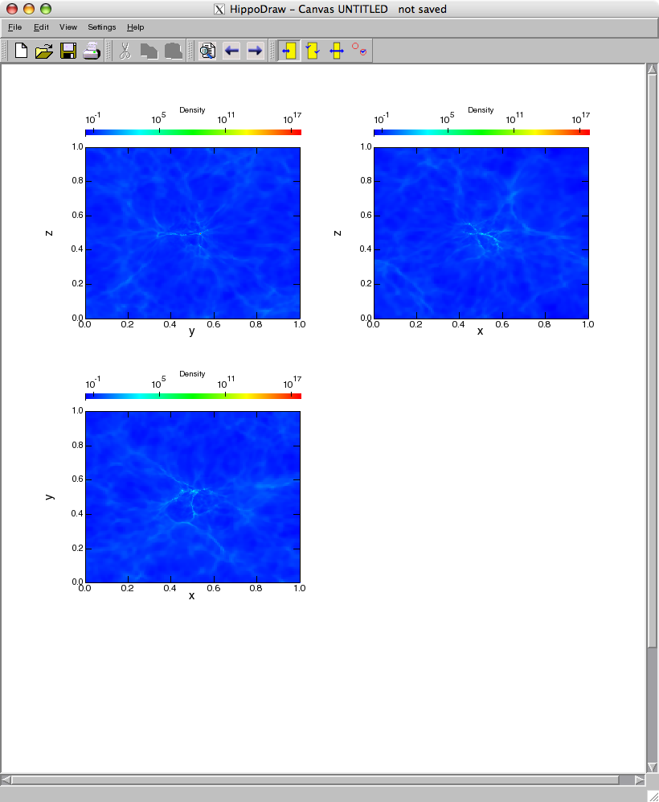
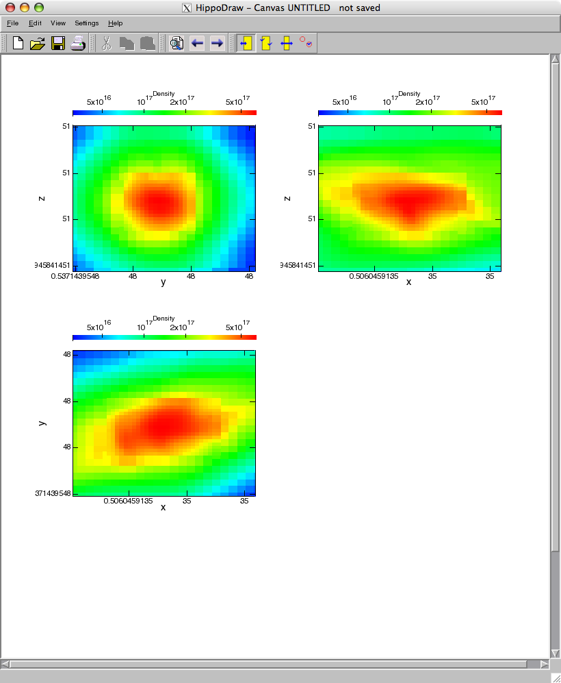
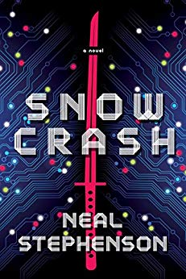

<!-- .slide: class="titleslide" -->

# Open Source & the Teen Years
## Matthew Turk
## CIRSS Seminar

---

# WARNING

This talk contains the following:

<div class="appearing_row">
  <div class="fragment" data-fragment-index="1"><div class="left_align">
    **2**
  </div></div>
  <div class="fragment" data-fragment-index="2"><div class="right_align">
    Star Wars references
  </div></div>
</div>

<br/>

<div class="appearing_row">
  <div class="fragment" data-fragment-index="1"><div class="left_align">
    **3**
  </div></div>
  <div class="fragment" data-fragment-index="2"><div class="right_align">
    Code snippets (all fake)
  </div></div>
</div>

<br/>

<div class="appearing_row">
  <div class="fragment" data-fragment-index="1"><div class="left_align">
    **3**
  </div></div>
  <div class="fragment" data-fragment-index="2"><div class="right_align">
    GIFs
  </div></div>
</div>

<br/>

<div class="appearing_row">
  <div class="fragment" data-fragment-index="1"><div class="left_align">
    **4**
  </div></div>
  <div class="fragment" data-fragment-index="2"><div class="right_align">
    Unsupported Assertions
  </div></div>
</div>

<br/>

<div class="appearing_row">
  <div class="fragment" data-fragment-index="1"><div class="left_align">
    **At Least Two**
  </div></div>
  <div class="fragment" data-fragment-index="2"><div class="right_align">
    Visualization Crimes
  </div></div>
</div>

<br/>

---

#### I will be sharing reflections from *my* experiences being a part of the community of open source scholarly/scientific software.

Neither social nor technical changes are distributed evenly over time. <!-- .element class="fragment" -->

Academic identity is already messed up, and the "marketplace" of projects only worsens it. <!-- .element class="fragment" -->

Seeking "sustainability" is an inescapably existential problem.  <!-- .element class="fragment" -->

All is not lost! <!-- .element class="fragment" -->

---

## Trivia time!

Groups of animals are fun.  What do you call a group of ...

<div class="appearing_row">
  <div class="fragment">
    <div class="left_align">
    **Apes**?
    </div>
  </div>
  <div class="fragment">
    <div class="right_align">
      A **shrewdness**!
    </div>
  </div>
</div>

<br/>

<div class="appearing_row">
  <div class="fragment">
    <div class="left_align">
    **Cobras**?
    </div>
  </div>
  <div class="fragment">
    <div class="right_align">
      A **quiver**!
    </div>
  </div>
</div>

<br/>

<div class="appearing_row">
  <div class="fragment">
    <div class="left_align">
    **Owls**?
    </div>
  </div>
  <div class="fragment">
    <div class="right_align">
      A **parliament**!
    </div>
  </div>
</div>

<br/>

<div class="appearing_row">
  <div class="fragment">
    <div class="left_align">
    **Tortoises**?
    </div>
  </div>
  <div class="fragment">
    <div class="right_align">
      A **bale**!
    </div>
  </div>
</div>

<br/>

<div class="appearing_row">
  <div class="fragment">
    <div class="left_align">
    **Vultures**?
    </div>
  </div>
  <div class="fragment">
    <div class="right_align">
      A **wake**!
    </div>
  </div>
</div>

<br/>

<div class="appearing_row">
  <div class="fragment">
    <div class="left_align">
    **Anecdotes**?
    </div>
  </div>
  <div class="fragment">
    <div class="right_align">
      &nbsp;
    </div>
  </div>
</div>

---

## The "Landscape" of Open Source: 1999

<div class='multiCol'>
  <div class='col'>
    **Semi-Globally**
    <div class="fragment mediumtext">
      <p class="fragment">
        You could buy Debian in Electronics Boutique! And Quake III for Linux!
      </p>
      <p class="fragment">
        The "world" was still "reeling" from the Halloween Documents.
      </p>
      <p class="fragment">
        Andover (RIP) (who published Slashdot (not-quite-RIP)) was about to be bought by VA Linux (RIP)
      </p>
      <p class="fragment">
        Sourceforge was just being launched.
      </p>
      <p class="fragment">
        Python 1.5.2 was out.
      </p>
    </div>
  </div>
  <div class='col'>
    **Personally**
    <div class="fragment mediumtext">
      <p class="fragment">
        I bought Debian at Electronics Boutique!  (Also Quake III for Linux.)
      </p>
      <p class="fragment">
        Wow, those Halloween Documents!  Microsoft is the Big Bad this season!
      </p>
      <p class="fragment">
        I had "perfect" karma on Slashdot.  (And a 7-digit ICQ ID.)
      </p>
      <p class="fragment">
        `GW-BASIC.EXE` wouldn't launch on my linux machine.
      </p>
      <p class="fragment">
        Monty Python was still in reruns on Comedy Central.
      </p>
    </div>
  </div>
</div>

---

<!--.slide: data-background-image="images/peace_love_linux_2k.jpg" data-background-color="#000" data-background-size="auto 100%" data-background-position="center center" -->

---

## The "Landscape" of Open Source: 2006

<div class='multiCol'>
  <div class='col'>
    **Semi-Globally**
    <div class="fragment mediumtext">
      <p class="fragment">
        OSX had brought a Unix-alike to academics everywhere.
      </p>
      <p class="fragment">
        Python 2.5 was released.  NumPy was uniting the community fragmented between numeric numarray.
      </p>
      <p class="fragment">
        GPLv3 was fresh and new.
      </p>
      <p class="fragment">
        "Properly" open source was still the exception in academia.
      </p>
      <p class="fragment">
        Distributed version control was starting to arrive (mostly) in the form of `git`, `hg` and `bzr`.  ("Begun, the Bitkeeper war has.")
      </p>
      <p class="fragment">
        Move over, SourceForge! Google Code is here!
      </p>
    </div>
  </div>
  <div class='col'>
    **Personally**
    <div class="fragment mediumtext">
      <p class="fragment">
        I was three years into graduate school and both convinced I knew everything and convinced I shouldn't make too big of a fuss.
      </p>
      <p class="fragment">
        Everybody in astronomy just uses IDL.  Or C.  Or sometimes (me), Octave.
      </p>
      <p class="fragment">
        "How can I trick them into letting me use GPL so I can force social change?"
      </p>
      <p class="fragment">
        I can think of no instances where `CVS` or `svn` are not sufficient.
      </p>
    </div>
  </div>
</div>

---

<!-- .slide: data-background-image="images/enzo_output.jpg" data-background-size="90% auto" data-background-position="center center" data-background-color="#000" -->

---

<!-- .slide: data-background-image="images/octave_output.jpg" data-background-size="auto 90%" data-background-position="center center" -->

---

<!-- .slide: data-background-image="images/visit_output.jpg" data-background-size="auto 90%" data-background-position="center center" -->

---

## Turmoil has engulfed the Galactic Republic.  The taxation of trade routes to outlying star systems...

IDL was expensive, and we only had so many licenses. <!-- .element: class="fragment" -->

Also, I felt like I had to prove something. <!-- .element: class="fragment" -->

(We'll return to this later.) <!-- .element: class="fragment" -->

---

## The "Perfectly Reasonable Path"

"I remember Python!  It's good for laying out VHS boxes.  I bet it can do this stuff too."

(Unearned confidence will continue to be a theme.) <!--.element: class="fragment" -->

----

## The "Perfectly Reasonable Path"

"Ooh, then I won't have to learn IDL."

```python
import numarray as na
f = open("RedshiftOutput0030.hierarchy")
for line in f.readlines():
    values = line.split("=")
    left = values[0]
    right = values[1]
```

(and so on)

----

## The "Perfectly Reasonable Path"

"Now I just need to figure out how to do unit conversions."

```python

import numarray as na

densityUnits = 1.54e-21

...

```

Still lots of handwritten code.  But guess what that didn't stop me from doing?

That's right, telling other people they should use it!

---

## The "Perfectly Reasonable Path"

"Wouldn't it be nice if we could see what it did?  Let's try this
locally-developed application, HippoDraw!"

<div class='multiCol'>
  <div class='col'>
    
  </div>
  <div class='col'>
    
  </div>
</div>

---

## The "Perfectly Reasonable Path"

<div class='multiCol'>
  <div class='col'>
    <p>"This is getting awfully complex."</p>
    <p class="fragment">"What it really needs is a name."</p>
  </div>
  <div class='col'>
    
  </div>
</div>

---

## It worked for me, so...

Maybe other people can do it?

 1. Make this thing
 2. Let other people use it
 3. ???
 4. Profit!

(Slashdot jokes never (?) get old!) <!-- element: class="fragment" -->

---

<!-- .slide: data-background-image="images/jeffs_notebook.jpg" data-background-size="115% auto" data-background-position="center center" -->

---

## Growth, but Stable

Our dependency list remained nearly static for a *very* long time:

 * `numpy`
 * `matplotlib`
 * `h5py`

And we went to *great* lengths to keep it that short.

---

## Growth and Scaling!

We aggressively aimed to build a community.

(...let's dissect that "aggression," shall we?) <!-- .element: class="fragment" -->

---

<!-- .slide: data-background-image="images/yt_workshop.jpg" data-background-size="auto 100%" data-background-position="center center" -->

---

### Assertion 1:

**Neither social nor technical changes are distributed evenly over time.**

<p class="fragment mediumtext">
  The broad landscape didn't change very much for a while.  Within the Python arena, folks mostly used matplotlib, folks mostly used numpy, and folks mostly didn't have a really amazing story for how to install stuff.
</p>
<p class="fragment mediumtext">
  The distinction between people who "made" software in academia and people who "used" software in academia was pretty strong.  Software was just a thing you used, not something you were a part of.
</p>

---

<!-- .slide: data-background-iframe="https://www.openhub.net/p/yt_amr" data-background-interactive -->

---

## The "Landscape" of Open Source: 2013

<div class='multiCol'>
  <div class='col'>
    **Semi-Globally**
    <div class="fragment mediumtext">
      <p class="fragment">
        OSX was kind of annoying to develop on again, but still pretty usable.
      </p>
      <p class="fragment">
        Python 3?  Sure, I guess!
      </p>
      <p class="fragment">
        Permissive licenses: the only way to fly.
      </p>
      <p class="fragment">
        "Open Source" was on its way to becoming an assumption in many parts of academia.
      </p>
      <p class="fragment">
        If you weren't using `git`, you were a bit of an outcast.
      </p>
      <p class="fragment">
        "Community" was a buzzword (and a successfully-revived TV show).
      </p>
    </div>
  </div>
  <div class='col'>
    **Personally**
    <div class="fragment mediumtext">
      <p class="fragment">
        I was four years out from my PhD, finishing up my second postdoc, getting married, having a kid and moving to Illinois from New York.
      </p>
      <p class="fragment">
        Thanks, but I'll use Python 2.  (Also, what's this new `pandas` thing?)
      </p>
      <p class="fragment">
        Re-licensing will be our gateway to uptake!
      </p>
      <p class="fragment">
        Wait, you don't need to be convinced anymore?
      </p>
      <p class="fragment">
        We weren't using `git`, because `hg` was (is) better.  It's *your* problem if you don't see that.
      </p>
      <p class="fragment">
        Turns out, if you're not careful, growth can saturate.
      </p>
    </div>
  </div>
</div>

---

### Assertion 1 (revisited):

**Neither social nor technical changes are distributed evenly over time.**

<p class="fragment mediumtext">
  All of a sudden, practices we thought were innovative -- direct outreach to users to contribute, thinking about capital-C Community, engaging people at many different research backgrounds -- were a bit ... passe.
</p>
<p class="fragment mediumtext">
  Technologies started to shift *rapidly*.  New visualization engines, new parallelism engines and new IO routines became popular and even *prevalent*.
</p>

---

## Inertia

All of a sudden, we had hundreds of users who -- rightly -- were not terribly keen on having everything change underneath them.

And some of us were making the transition to different career paths.

"Look, you have to recognize that this isn't just some thing, it's a Thing, and some of us have built careers around it." --said to me, 2013

---

<!-- .slide: data-background-iframe="https://ytep.readthedocs.io/en/master/YTEPs/YTEP-1776.html" data-background-interactive -->

---

## Taking This Seriously

"OK, let's get some funding for it." <!-- .element: class="fragment" -->

"Who calls the shots?" <!-- .element: class="fragment" -->

"Don't pull the rug out!" <!-- .element: class="fragment" -->

---

## Holding Things Back

I held us back in a few critical ways.

---

## The "Landscape" of Open Source: 2019

<div class='multiCol'>
  <div class='col'>
    **Semi-Globally**
    <div class="fragment mediumtext">
      <p class="fragment">
        Docker?  ...docker.  Docker?  Docker!  Docker.
      </p>
      <p class="fragment">
        Python, Javascript, Julia, Rust, R
      </p>
      <p class="fragment">
        <a href="https://en.wikipedia.org/wiki/Anyone_Can_Play_Guitar">"Anyone can play guitar."</a>
      </p>
      <p class="fragment">
        web or it didn't happen
      </p>
    </div>
  </div>
  <div class='col'>
    **Personally**
    <div class="fragment mediumtext">
      <p class="fragment">
        Is it fair to ask people to work on this?
      </p>
      <p class="fragment">
        How finely sliced can time become?
      </p>
      <p class="fragment">
        Some of the stuff that was really hard ... isn't necessary anymore.
      </p>
      <p class="fragment">
        Also, who cares what you think anyway?
      </p>
    </div>
  </div>
</div>


---

### Assertion 2:

**Academic identity is already messed up, and the "marketplace" of projects only worsens it.**

---

<!-- .slide: data-background-image="images/what_would_you_say.png" data-background-size="auto 100%" data-background-position="center center" -->

---

### Assertion 3:

**Seeking "sustainability" is an inescapably existential problem.**

---

<iframe seamless="seamless" style="align:center; width: 100%; border: none; display: block; max-width: 768px; height: 600px;" src="https://getyarn.io/yarn-clip/embed/fc42a6cd-80ec-4842-b7fa-75d492a5600b?autoplay=false"> </iframe>

---

## Navigating Disruptive Change

If stability is a key promise, how can we innovate?

If we can't innovate, what can we do?

---

<p class="mediumtext">(From https://medium.com/@mmaybl/apple-the-innovators-dilemma-5df4e70ab109 )</p>

<!-- .slide: data-background-image="https://cdn-images-1.medium.com/max/1600/0*qtH8rJM7MzjyfGhN.png" data-background-size="auto 70%" data-background-position="center bottom" -->

---

### Assertion 4:

**All is not lost!**

<p class="mediumtext">(He said, optimistically, hoping no one would notice his quavering tone of voice.)</p>

---

<!-- .slide: data-background-image="images/fellow_kids.png" data-background-size="auto 100%" data-background-position="center center" -->

---

## Exciting new things!

 * New people!
 * Engage the urge to be A Known Person in *others*.
 * Try some new technologies!

Now [some slides](https://munkm.github.io/2019-03-13-pydata/#/), courtesy of Madicken Munk, about where we're going!

---

# Thank you
